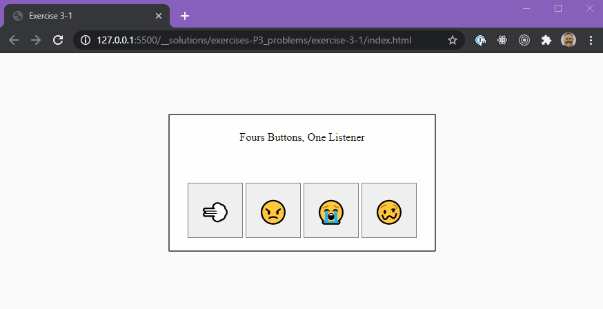
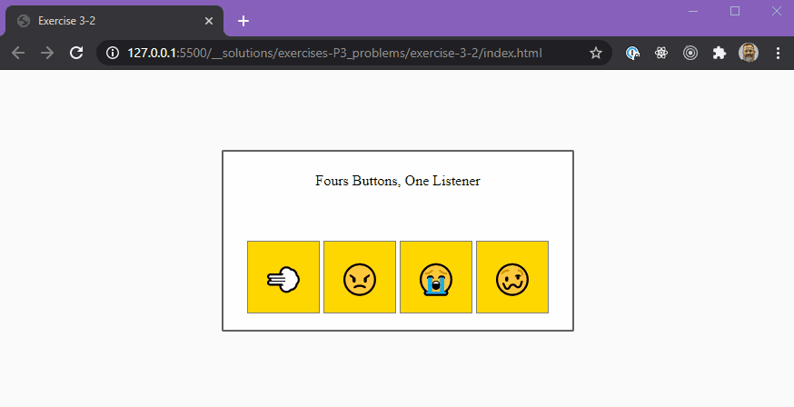
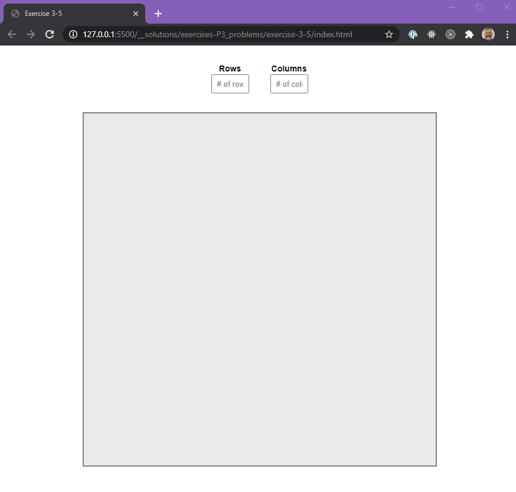

# JavaScript - The DOM - P1

---

## 🦊 Pre-lecture

⏲️ _Estimated time required: 45 minutes._

Read the first article and skim through the second one to begin to understand the power of the DOM and how it is used in JavaScript.

- Read the provided documents in the `__pre-lecture` folder.
- Read https://css-tricks.com/dom/ (article)
- Skim over this documentation: https://developer.mozilla.org/en-US/docs/Web/API/Document_Object_Model/Introduction

---

## 🦉 Lecture

[m2_d3.pdf](__lecture/m2_d3.pdf)

---

## Setup

```
yarn install
```

## Fundamentals

Starting today, there will be a fundamentals section in each workshop. Start by completing this section before moving on to the following exercises.

See the [\_\_workshop/\_fundamentals/README.md](./workshop/_fundamentals/README.md) in for more information.

---

## ⚡ Exercises

## Exercise 1 - Creating DOM Nodes


In this exercise, we'll see how to create web pages using Javascript alone!

In the exercise-1 folder, there are the following files.

- `example.html` (READ ONLY) This is the file that contains the HTML of a short webpage.
- `styles.css` (READ ONLY) Some styles that are used in `example.html`
- `exercise.html` (READ ONLY) This is the HTML file in which you will use JavaScript to recreate the HTML content from `example.html`
- `scripts.js` This is where you will write the JS required to inject all of the HTML into `exercise.html`
- `assets` Some images used in the example

Create the content of a webpage entirely with Javascript.

1. Recreate the content structure from `example.html`.
2. To do this, **you are not allowed to modify any of the HTML files**, only `scripts.js` should be modified.
3. Once you've completed this, compare `example.html` and your `exercise.html` file using "Live Preview", you will notice that they look nothing alike.
4. Add code to the `scripts.js` that will add a `<link>` to the `styles.css` in the `<head>` of `exercise.html`.

In other words: We'll start by recreating the HTML structure, without worrying about the styles. Once the HTML is correct, we'll add a `<link>` tag, which will add the relevant styles.

### How do I do this?

You'll need to make extensive use of `document.createElement`!

---

<center>🟡 - Minimally complete workshop (75%) - 🟡</center>

---

## Exercise 2 (2-1 to 2-5)

- You are only allowed to modify the `app.js` file, and perhaps the `index.html`.
- Look over the HTML file before beginning.
- The `app.js` file contains relevant hints.

### Exercise 2-1

There are 4 buttons that are supposed to do different things when clicked.

- button one disappears (initial opacity is `100`)
- button two turns 'crimson'
- button three turns 'lightblue'
- button four starts shaking... (animation provided in styles css as a class called `jitters`)



---

<center>🟢 - Complete workshop (100%) - 🟢</center>

---

### Exercise 2-2

#### STEP 1

- Reimplement the functionality of `2-1` (Try to NOT look at your previous solution).

#### STEP 2

- This time the buttons should toggle.
- Meaning if the user clicks on them a second time, it should go back to initial state.
- Initial button color is `gold`.



### Exercise 2-3

#### STEP 1

- Reimplement the functionality of `2-1` and `2-2`

#### STEP 2

- There should be a RESET button that "resets" all of the buttons to their original state.


---

## Exercise 3

Create a game board. The CSS will, for the most part, take care of itself as long as you assign the right classes to the cells.

### Exercise 3-1 - The Grid

#### Objectives

- set the size of the board to a square of `600px`;
- set a number of cells per row;
- the cells should all be square.
- cells should have a class of `cell`
- cells should have and id of `cell-#`


### Exercise 3-2 - The Custom Grid (Stretch)

#### Objectives

- Use the grid code you wrote in 3-1
- Allow the user to create cells on the board based on values he/she inputs.
- Ask the user the number of `ROWS` and `COLUMNS`
- Use those values to generate a grid


